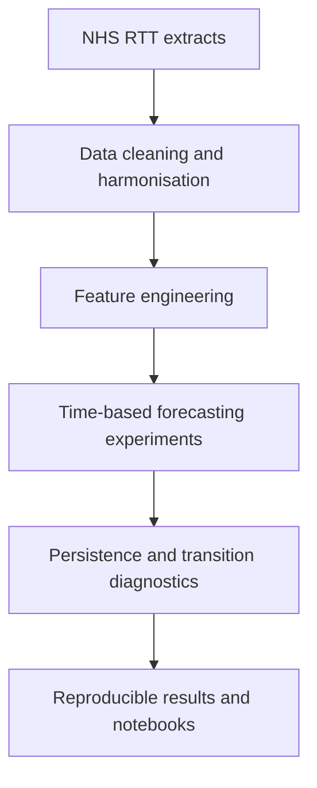

# Threshold Forecast Illusion

## Research-oriented workflow and design notes

### Executive summary

This repository is a reproducible research workflow for studying whether thresholded NHS
waiting-list outcomes can appear highly predictable even when the underlying levels are
near-random-walk processes. The project combines a structured data pipeline, forecasting
experiments, and persistence-based baselines around breach-risk prediction.

The work focuses on:

* reproducible data preparation from public NHS RTT extracts
* time-based forecasting and classification experiments
* comparison with simple persistence baselines
* analysis of transition cases and thresholded outcomes

---

## High-level workflow

---

## Data preparation layer

**Technology:** Python, pandas
**Purpose:** Store and process the raw NHS extracts in a reproducible way.

**Data Sources:**
* NHS Referral-to-Treatment datasets
* Waiting List datasets
* Activity datasets
* Demographic reference datasets

**Pipeline Steps:**
1. Download source files
2. Schema validation
3. Store immutable raw copies in S3 (Bronze)
4. Generate ingestion audit logs
5. Trigger Silver transformation workflow

**Artifacts:**
`bronze/referrals`, `bronze/waiting_lists`, `bronze/activity`, `bronze/demographics`

---

# Layer 2: Data Quality & Cleansing (Silver Layer)

**Technology:** Python, PySpark/Pandas, AWS S3
**Purpose:** Prevent poor-quality data from progressing; create a conformed, cleansed version of the data.

**Validation Rules:**
* Missing values & duplicate records
* Invalid dates (e.g., future timestamps)
* Outlier & schema mismatch detection

**Pipeline Steps:**
1. Read from Bronze
2. Apply validation rules and data cleansing
3. Standardize date formats and naming conventions
4. Write to Silver storage

**Artifacts:**
`silver/referrals_cleaned`, `silver/dq_results`, `silver/dq_failures`

---

## Analysis tables

**Technology:** Python, pandas, parquet
**Purpose:** Provide a consistent analysis grain for modeling and evaluation.

**Tasks:**
* conformance to a single provider × specialty × month grain
* feature engineering for lagged and rolling signals
* storage of derived analysis tables for reproducibility

---

# Layer 4: Feature Store

**Purpose:** Centralized storage for ML features, typically sourced from the Gold layer.

**Features:**
* **Rolling Metrics:** 7-day, 30-day, 90-day referrals
* **Time Features:** Week number, Month, Quarter
* **Operational Features:** Current backlog, Historical wait time, Service demand growth

**Storage:** `feature_waiting_time`, `feature_demand_forecast`, `feature_breach_risk`

---

## Modeling layer

**Model 1: Demand forecasting**
* **Objective:** Predict next-month waiting-list levels.
* **Algorithm:** XGBoost regressor
* **Output:** Point forecast

**Model 2: Waiting-time forecasting**
* **Objective:** Predict next-month waiting-time metrics.
* **Algorithm:** XGBoost / LightGBM
* **Output:** Point forecast

**Model 3: Breach-risk classification**
* **Objective:** Predict whether a provider-specialty will breach the 18-week standard next month.
* **Algorithm:** XGBoost classifier
* **Output:** Probability score

**Evaluation focus:**
* persistence baselines
* ROC AUC and precision-at-k
* transition-subset analysis

---

# Layer 6: Model Registry

**Purpose:** Track model lifecycle and versioning.

**Stored Metadata:**
* Version, Training Date, Metrics, Dataset Version, Feature Set

**Storage:** AWS S3 (`models/demand_forecast_v1.pkl`, `models/metadata.json`)

---

## Reproducibility and outputs

The project is designed to reproduce results from the notebooks and shared code modules,
with outputs written locally for inspection and further analysis.

---

## Monitoring and reproducibility

**Purpose:** Track data quality, model diagnostics, and whether the results remain stable over time.

**Metrics:**
* **Data Metrics:** Missing values, freshness, volume
* **Model Metrics:** Baseline comparison, AUC, calibration, transition diagnostics

---

## Notes on reproducibility

The repository is intended to be run locally from source, with notebooks and tests used to
reproduce the analysis and verify that the conclusions are consistent.
