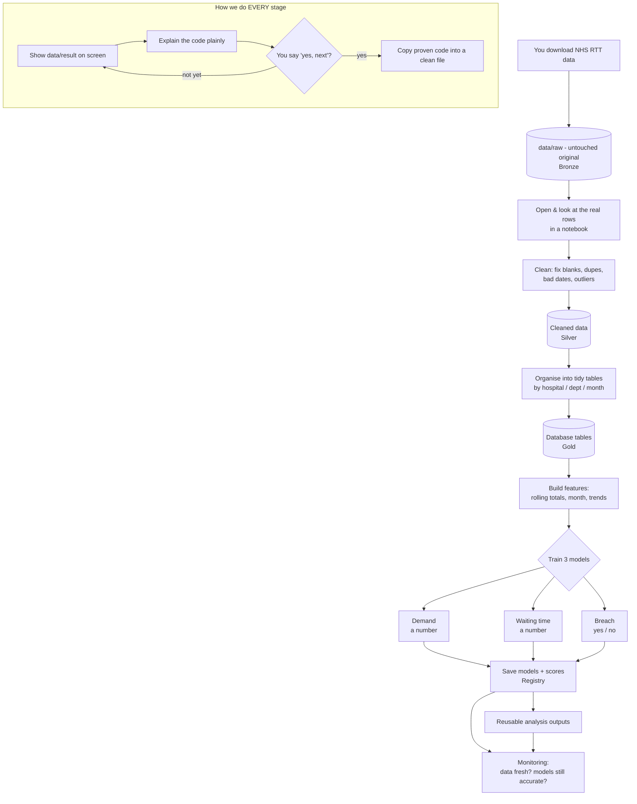
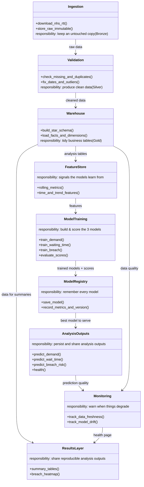

# Threshold Forecast Illusion — How This Project Works

*A plain-English guide to the research workflow and the reasoning behind it.*

---

## The one-sentence version

We take real NHS waiting-list data, clean it up, turn it into useful signals,
study how well simple models predict thresholded outcomes, and compare them
against persistence baselines — all in a way that is visible, reproducible,
and easy to inspect step by step.

---

## The goal in plain words

Hospitals have waiting lists. The question this project answers is:

- **How many referrals are coming next month?** (demand)
- **How long will people wait?** (waiting time)
- **Which provider-specialty units are about to miss the 18-week target?** (breach risk)

"RTT" is just the official name for the clock that starts when your GP refers
you and stops when treatment begins. The free NHS data comes already added up
by hospital, by department, by month — so we work at that level (one row =
"this department, this month").

---

## How we work together (the important part)

We don't build a giant finished machine in the dark. We build it like a guided
tour, in a **notebook** (a document where the code and its results sit together
— you run one chunk and the data or chart appears right underneath).

For every stage:

1. I show you the **real data or result** on screen.
2. I explain the **code** in plain words.
3. You say **"yes, next"** — then we move on.

So you see, and understand, every step.

Once a stage works and you're happy with it, I copy that proven code into a
clean, reusable file. Plain version:

> **The notebook is the workshop where we figure it out.
> The clean file is the finished, tidy version we keep.**

That gives you both: the hands-on learning experience *and* a real,
professional codebase at the end.

---

## The journey of the data (the nine steps)

Think of the data flowing through stages, getting more useful at each one.
The medallion names (Bronze / Silver / Gold) are just a common way to label
"raw → cleaned → ready-to-use."

1. **Get the data (Bronze = raw).** You download the NHS file yourself and drop
   it in `data/raw/`. We open it and look at the real rows. Nothing is changed —
   this is the untouched original.

2. **Clean it (Silver = cleaned).** We find the problems — blanks, duplicates,
   weird dates, odd values — fix them, and look at the before-and-after.

3. **Shape it for business (Gold = ready).** We organise the clean data into
   neat tables (totals by hospital, department, month) stored in a proper
   database, ready for both charts and models.

4. **Build the signals (features).** We create the columns that help prediction:
   rolling totals (last 7 / 30 / 90 days), the month and quarter, growth trends,
   current backlog. After each one we print and chart it so you can see what it
   captures.

5. **Teach the computer (models).** Three predictions, each in its own notebook:
   - **Demand** — how many referrals next month (a number).
   - **Waiting time** — average wait / share seen within 18 weeks (a number).
   - **Breach** — will this department miss the target next month? (yes/no).
   We see the accuracy scores and plot predicted-vs-actual.

6. **Keep track of the models.** We save each trained model with a note of when
   it was trained, how accurate it was, and what data it used — so we can always
   go back and compare.

7. **Check the baseline.** We compare model predictions to a simple persistence
   baseline so we can be clear about whether any apparent gain is real or just a
   consequence of the thresholding structure.

8. **Inspect transitions.** We focus on the cases that change state between one
   month and the next, because these are the cases that matter most for the
   research question.

9. **Document the results.** The cleaned tables and analysis notebooks make it
   straightforward to reproduce the findings and share them as research notes.

---

## Diagram 1 — The flow (how the data and the work move)

---

## Diagram 2 — UML (the parts of the system and how they connect)

This shows the building blocks (each box is one component), what each one is
responsible for, and the arrows show "this one feeds the next one."

---

## What "done" looks like

- A clean repo with notebooks and reusable code files.
- Real NHS data flowing through the full analysis workflow.
- Reproducible forecasting experiments with explicit persistence baselines.
- Transition-focused diagnostics for thresholded breach outcomes.
- Tests that check leakage, baseline comparisons, and output validity.

We build it one visible step at a time — you never lose sight of the data.
